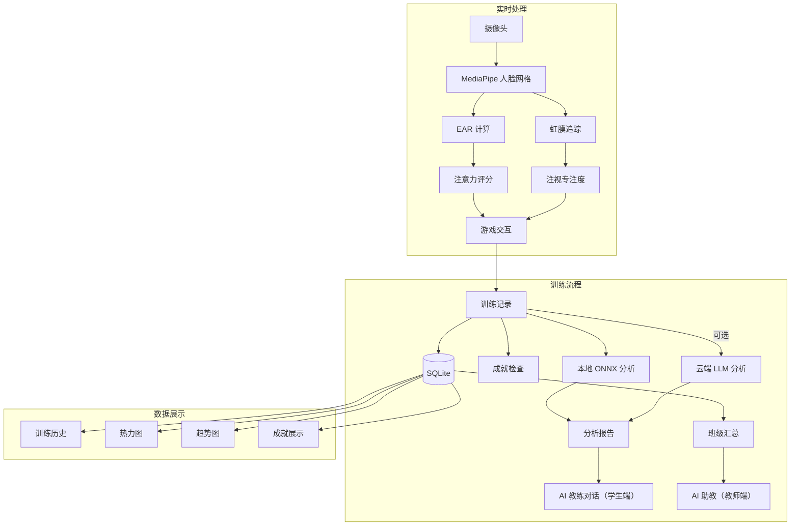

# 游戏化注意力训练系统

> 面向中小学校及个人的 AI 驱动注意力训练平台 | 硬件仅需摄像头 + 个人计算机

---

## 📖 开发背景

### 现实痛点

在数字化时代，中小学生面临前所未有的注意力挑战：

- **电子设备泛滥**：智能手机、平板、短视频等碎片化信息源不断侵蚀青少年的持续专注能力
- **课堂注意力下降**：教师普遍反映学生课堂上"坐不住"、"走神频繁"，传统教学方式难以有效干预
- **缺乏科学训练工具**：市面上大多数"注意力训练"产品停留在简单的游戏层面，缺乏客观的生物反馈和科学评估
- **专业设备门槛高**：脑电仪、眼动仪等专业注意力评估设备动辄数万元，普通学校和家庭无法负担
- **个性化指导缺失**：训练结束后缺乏数据驱动的分析和针对性建议，训练效果难以持续优化

### 项目愿景

**让每一个学生都能拥有"便携式的注意力教练"** —— 仅需一台带摄像头的普通电脑，即可获得：

- 🧠 **科学评估**：基于计算机视觉的客观注意力测量
- 🎮 **趣味训练**：游戏化机制激发持续参与动力
- 🤖 **AI 陪伴**：学生端 AI 教练 + 教师端 AI 助教，大模型驱动的个性化教练与反馈
- 📊 **数据追踪**：可视化成长轨迹，让进步"看得见"

### 技术路线选择

| 技术决策 | 理由 |
|---------|------|
| **MediaPipe + ONNX** | 轻量级本地推理，无需 GPU，保护隐私，降低部署成本 |
| **PySide6 (Qt)** | 跨平台桌面应用，性能优于 Web，适合学校机房部署 |
| **SQLite 本地存储** | 零配置，数据归属清晰，符合学校数据安全要求 |
| **混合 AI 架构** | 本地 ONNX 模型保障基础功能离线可用；云端 LLM 提供深度分析（可选） |
| **游戏化设计** | 将枯燥的注意力训练转化为"找茬"和"动态追踪"游戏，降低抵触心理 |

---

## 🎯 系统简介

本系统通过摄像头实时监测用户的**眨眼频率**、**视线专注度**和**头部姿态**，结合游戏化训练模式，提供个性化的注意力训练方案。系统内置学生端 **AI 教练** 与教师端 **AI 助教** 模块，能够根据训练数据生成分析报告和针对性建议。

### 系统特色

✅ **低成本部署**：普通 PC + USB 摄像头即可运行，无需专业硬件  
✅ **隐私优先**：所有生物特征数据本地处理，不上传云端  
✅ **离线可用**：核心分析功能完全离线（需云端 LLM 的功能可选）  
✅ **多角色支持**：学生、教师、管理员三级权限，适配学校场景  
✅ **游戏化激励**：成就系统 + 实时反馈 + AI 鼓励，提升训练依从性  

---

## 📦 核心功能

### 1. 🎮 游戏化训练

| 模式 | 玩法 | 训练目标 |
|------|------|---------|
| **🔍 找茬模式** | 在右侧区域快速扫描并点击隐藏的差异点 | 视觉搜索、持续注意力、反应速度 |
| **🎯 动态追踪模式** | 用鼠标追踪不断移动的红色目标 | 手眼协调、追踪能力、反应时 |

**自适应难度**：根据最近训练的平均注意力自动推荐难度（平均 ≥75 推荐困难，≤50 推荐简单，其余推荐普通），也可手动选择简单/普通/困难/自定义

**得分机制**：每命中一个点得 10 分；连击达到 5/10/15/20/25 次后，单次命中得分分别 +6%/12%/18%/24%/30%（25 连击封顶）；未命中每次使单次得分降低 5%（最多累计 -25%），连击 ≥5 次恢复正常

### 2. 🤖 AI 智能分析

| 能力 | 说明 |
|------|------|
| **本地 ONNX 分析** | 训练结束后即时生成结构化报告（专注等级、疲劳度、综合评分），无需联网 |
| **云端 LLM 分析**（可选） | 对接 OpenAI 兼容 API，生成深度、温暖、个性化的分析报告 |
| **AI 教练对话** | 基于训练数据与用户进行多轮对话，提供针对性指导（学生端专属） |
| **教师端 AI 助教** | 教师/管理员专属：班级汇总、单学生下钻、风险提示与训练建议（云端 LLM + 本地规则兜底） |
| **智能推荐** | 根据训练历史推荐最优模式与难度组合（本地 ONNX 模型优先） |

### 3. 👁️ 实时生物反馈

- **眨眼检测**：通过 EAR（眼睛纵横比）算法实时监测眨眼频率
  - 支持手动阈值调节 / 自适应 EAR 两种模式
  - 可选 ONNX 模型（OCEC）提升检测精度
- **注视追踪**：基于虹膜位置估计视线偏离距离
- **注意力评分**：综合 EAR、眨眼频率、注视专注度等多维度计算（0-100）
- **头部姿态估计**（可选）：检测低头/转头等姿态变化，辅助评估专注状态

### 4. 🏆 成就与数据管理

**20 项成就**（找茬/追踪各 10 项）激励持续训练：

| 成就 | 解锁条件 |
|------|---------|
| 🔍 找茬新手 | 完成第一次找茬模式训练 |
| 👁️ 火眼金睛 | 找茬模式累计找到 100 个差异点 |
| ⚡ 连击新星 / 完美连击 | 找茬模式单次达成 10 / 20 连击 |
| 🏆 高分突破 / 👑 找茬大师 | 找茬模式单次得分达到 300 / 500 |
| 💎 完美游戏 | 找茬模式单次训练：注意力 80+、得分 500+、连击 10+ |
| 🧠 专注达人 | 找茬模式单次平均注意力达到 80 分 |
| 🕒 坚持之星 | 找茬模式累计训练 60 分钟 |
| 🔥 高频训练 | 找茬模式累计训练 20 次 |
| 🎯 追踪新手 | 完成第一次动态追踪模式训练 |
| 🎯 弹无虚发 | 动态追踪单次命中率达到 90% |
| ⚡ 反应神速 | 动态追踪单次平均响应不超过 0.5 秒 |
| 🧭 精准路径 | 动态追踪单次路径效率达到 80% |
| 🏆 追踪突破 / 👑 追踪大师 | 动态追踪单次得分达到 80 / 90 |
| 💎 完美追踪 | 动态追踪单次训练：注意力 80+、得分 90+ |
| 🧠 专注达人 | 动态追踪模式单次平均注意力达到 80 分 |
| 🕒 坚持之星 | 动态追踪模式累计训练 60 分钟 |
| 🔥 高频训练 | 动态追踪模式累计训练 20 次 |

**数据可视化**：
- 📈 注意力/得分/眨眼/注视指标趋势图
- 🔥 专注度热力图（行 = 指标，列 = 训练次数，颜色表示相对表现）

### 5. 👥 多用户支持

| 角色 | 权限 |
|------|------|
| **管理员** | 用户管理（增删改查）、查看所有数据 |
| **教师/家长** | 班级报告（查看所管学生的训练汇总与趋势）、AI 助教咨询、学生分配 |
| **学生** | 个人训练、AI 教练对话、查看个人记录与成就 |

---

## 🏗️ 技术架构

### 整体架构图

```
┌─────────────────────────────────────────────────────────────────────┐
│                         用户界面层 (UI Layer)                       │
│  ┌──────────┐ ┌──────────┐ ┌──────────┐ ┌──────────┐ ┌──────────┐ │
│  │ 主窗口   │ │ 训练窗口 │ │ 登录/注册│ │ 设置面板 │ │ 成就面板 │ │
│  └──────────┘ └──────────┘ └──────────┘ └──────────┘ └──────────┘ │
│  ┌──────────┐ ┌──────────┐ ┌──────────┐ ┌──────────┐ ┌──────────┐ │
│  │ 训练记录 │ │ 班级报告 │ │ AI教练   │ │ 热力图   │ │ 智能推荐 │ │
│  └──────────┘ └──────────┘ └──────────┘ └──────────┘ └──────────┘ │
└─────────────────────────────────────────────────────────────────────┘
                                    │
┌─────────────────────────────────────────────────────────────────────┐
│                       业务逻辑层 (Business Layer)                   │
│  ┌────────────┐ ┌────────────┐ ┌────────────┐ ┌────────────┐      │
│  │ 游戏引擎   │ │ AI教练     │ │ 成就管理   │ │ 用户管理   │      │
│  │ (找茬/追踪)│ │ (对话/分析)│ │ (20项成就) │ │ (角色权限) │      │
│  └────────────┘ └────────────┘ └────────────┘ └────────────┘      │
│  ┌────────────┐ ┌────────────┐ ┌────────────┐ ┌────────────┐      │
│  │ 会话管理   │ │ 推荐引擎   │ │ 报告生成   │ │ 本地分析   │      │
│  │ (多用户)   │ │ (模式/难度)│ │ (HTML/CSV) │ │ (ONNX)     │      │
│  └────────────┘ └────────────┘ └────────────┘ └────────────┘      │
└─────────────────────────────────────────────────────────────────────┘
                                    │
┌─────────────────────────────────────────────────────────────────────┐
│                      基础设施层 (Infrastructure Layer)              │
│  ┌────────────┐ ┌────────────┐ ┌────────────┐ ┌────────────┐      │
│  │ 摄像头管线 │ │ ONNX推理   │ │ SQLite     │ │ 设置存储   │      │
│  │ (MediaPipe)│ │ (4个模型)  │ │ 数据库     │ │ (INI)      │      │
│  └────────────┘ └────────────┘ └────────────┘ └────────────┘      │
│  ┌────────────┐ ┌────────────┐ ┌────────────┐ ┌────────────┐      │
│  │ LLM客户端  │ │ 壁纸管理   │ │ 声音管理   │ │ 路径管理   │      │
│  │ (OpenAI兼容)│ │ (自定义)   │ │ (反馈音效) │ │ (跨平台)   │      │
│  └────────────┘ └────────────┘ └────────────┘ └────────────┘      │
└─────────────────────────────────────────────────────────────────────┘
```

### 核心技术栈

| 层级 | 技术 | 版本要求 |
|------|------|---------|
| **GUI 框架** | PySide6 (Qt for Python) | ≥ 6.5.0 |
| **计算机视觉** | MediaPipe | ≥ 0.10.0 |
| | OpenCV-Python | ≥ 4.8.0 |
| **AI 推理** | onnxruntime / onnxruntime-gpu（可选） | ≥ 1.29.0（默认纯 CPU 推理） |
| **数据库** | SQLite3 | 内置 |
| **配置管理** | QSettings (INI) | 内置 |
| **HTTP 客户端** | requests | ≥ 2.28.0 |

### 数据流



---

## 💻 环境要求

### 硬件要求

| 配置项 | 最低要求 | 推荐配置 |
|--------|---------|---------|
| CPU | 双核 2.0GHz | 四核 2.5GHz+ |
| 内存 | 4GB RAM | 8GB RAM |
| 摄像头 | 支持 OpenCV 的 USB 摄像头 | 720p 及以上 |
| 存储空间 | 500MB | 1GB |
| GPU（可选） | — | NVIDIA GPU + CUDA 11.8+ |

### 软件要求

| 操作系统 | 版本 |
|---------|------|
| Windows | 10/11 (64-bit) |
| macOS | 10.15+ (Intel/Apple Silicon) |
| Linux | Ubuntu 20.04+ / 其他主流发行版 |

**Python 版本**：3.9 ~ 3.11


## 🔑 默认账户

系统首次启动时自动创建以下演示账户：

| 角色 | 用户名 | 密码 | 权限说明 |
|------|--------|------|---------|
| 👑 管理员 | `admin` | `admin123` | 全部权限，可管理用户和系统 |
| 👨‍🏫 教师 | `teacher` | `teacher123` | 可查看班级报告、管理学生 |
| 👨‍🎓 学生 | `student` | `student123` | 个人训练、AI 教练、查看个人数据 |

> ⚠️ **安全提示**：首次登录后请立即修改默认密码！

> 📝 **自助注册**：登录窗口提供「注册」页签，新用户可自助创建**学生**或**教师/家长**账户；管理员账户不开放自助注册。

---

## ⚙️ 配置说明

### 基础设置

| 配置项 | 说明 | 推荐值 |
|--------|------|--------|
| **EAR 阈值** | 闭眼检测灵敏度，值越小越灵敏 | 0.22 ~ 0.28 |
| **自适应 EAR** | 根据历史记录自动调节阈值 | 开启 |
| **眨眼灵敏度** | 1-10 级，越高响应越灵敏 | 5 |
| **界面模式** | 白天 / 夜间 | 根据环境选择 |

### 难度设置

| 难度 | 找茬模式 | 动态追踪模式 | 位置随机性 |
|------|---------|-------------|-----------|
| 简单 | 间隔 1500ms，点大小 50px | 间隔 1500ms，点大小 40px | 0.2（集中中心区域） |
| 普通 | 间隔 1500ms，点大小 30px | 间隔 1500ms，点大小 20px | 0.6（中心区域为主） |
| 困难 | 间隔 1500ms，点大小 12px | 间隔 1500ms，点大小 8px | 1.0（全区域随机） |
| 自动 | 根据平均注意力动态推荐难度 | 同左 | 按推荐难度取值 |
| 自定义 | 用户自由调节所有参数 | 同左 | 1.0 |

### AI 智能助手

| 配置项 | 说明 |
|--------|------|
| **启用 AI 分析** | 训练结束后自动生成 AI 报告 |
| **本地模型分析** | 使用内置 ONNX 模型，无需联网 |
| **API 密钥** | OpenAI 兼容接口的 API Key |
| **API 地址** | 如 `https://api.openai.com/v1/chat/completions` |
| **模型名称** | 如 `gpt-3.5-turbo`、`deepseek-chat` |

### ONNX 模型设置

| 模型 | 功能 | 回退方案 |
|------|------|---------|
| YuNet | 人脸检测 | MediaPipe 人脸网格 |
| OCEC | 眨眼检测（概率输出） | EAR 阈值法 |
| 6DRepNet | 头部姿态估计 | 跳过 |
| L2CS | 视线估计 | 虹膜位置法 |

> 4 个 ONNX 视觉模型默认关闭，在「训练设置 → ONNX 使用设置」中按需开启；GPU 加速为可选项，默认纯 CPU 推理。

---

## 📁 项目结构

```
attention_training_py/
├── main.py                      # 程序入口
├── run.py                       # 便捷启动脚本（自动添加项目路径）
├── build.py                     # 打包入口
├── dynamic_build.py             # 动态打包（自动收集模块、生成 spec）
├── build.bat                    # Windows 一键打包脚本
├── hook_pyside6_runtime.py      # PySide6 运行时打包 hook
├── pyproject.toml               # 项目/打包配置
├── requirements.txt             # Python 依赖
├── README.md                    # 项目说明
│
├── ai/                          # AI 模块
│   ├── __init__.py
│   ├── ai_analysis_manager.py   # AI 分析调度器（单例 + 队列）
│   ├── ai_thread_worker.py      # AI 分析工作线程
│   ├── ai_coach.py              # AI 教练对话服务（多轮对话，学生端）
│   ├── coach_logic.py           # 教练对话逻辑（系统提示、本地回复）
│   ├── teacher_coach.py         # 教师端 AI 助教服务（Manager/Worker）
│   ├── teacher_coach_logic.py   # 教师端提示词与本地规则回复
│   ├── teacher_report_logic.py  # 班级汇总纯逻辑
│   ├── composite_scoring.py     # 综合评分计算
│   └── local_analysis.py        # 本地 ONNX 分析引擎
│
├── camera/                      # 摄像头模块
│   ├── __init__.py
│   ├── camera_worker.py         # 摄像头工作线程（MediaPipe + ONNX 混合）
│   └── onnx_vision.py           # ONNX 视觉引擎（4 个模型推理）
│
├── core/                        # 核心业务模块
│   ├── __init__.py
│   ├── settings.py              # 全局设置管理（QSettings + SQLite）
│   ├── database.py              # SQLite 数据库操作
│   ├── user_manager.py          # 用户管理（CRUD + 权限）
│   ├── user_session.py          # 用户会话管理（锁 + 切换）
│   ├── achievement_manager.py   # 成就系统（20 项成就 + 进度追踪）
│   ├── llm_client.py            # LLM 客户端（OpenAI 兼容 API）
│   ├── sound_manager.py         # 音效管理（反馈音效）
│   └── paths.py                 # 跨平台路径工具
│
├── games/                       # 游戏模块
│   ├── __init__.py
│   ├── game_interface.py        # 游戏基类（接口定义）
│   ├── scoring.py               # 得分规则（连击加成、未命中惩罚）
│   ├── spot_difference_game.py  # 找茬模式实现
│   └── tracking_game.py         # 动态追踪模式实现
│
├── ui/                          # 用户界面
│   ├── __init__.py
│   ├── main_window.py           # 主窗口（导航 + 功能入口）
│   ├── training_window.py       # 训练窗口（游戏 + 摄像头 + 计时）
│   ├── login_dialog.py          # 登录/注册对话框
│   ├── setting_dialog.py        # 设置对话框（全部配置项）
│   ├── achievement_dialog.py    # 成就展示对话框
│   ├── training_record_dialog.py # 训练记录（表格 + 图表 + 热力图）
│   ├── teacher_report_dialog.py # 班级报告（教师/管理员）
│   ├── teacher_coach_dialog.py  # 教师端 AI 助教对话窗口
│   ├── user_management_dialog.py # 用户管理（管理员）
│   ├── ai_coach_dialog.py       # AI 教练对话窗口
│   ├── recommend_dialog.py      # 智能推荐对话框
│   ├── mode_select_dialog.py    # 模式选择对话框
│   ├── time_select_dialog.py    # 时长选择对话框
│   └── heatmap_widget.py        # 专注度热力图控件
│
├── utils/                       # 工具模块
│   └── wallpaper_manager.py     # 壁纸管理（加载/绘制/缓存）
│
├── tools/                       # 工具脚本
│   ├── download_vision_models.py # 下载 ONNX 视觉模型
│   ├── train_local_models.py     # 训练本地分析模型
│   ├── verify_local_analysis.py  # 验证本地分析
│   └── verify_onnx_vision.py     # 验证 ONNX 视觉推理
│
├── tests/                       # 单元测试（unittest）
│
├── models/                      # ONNX 模型文件
│   ├── session_analysis.onnx    # 训练会话分析模型
│   ├── mode_recommend.onnx      # 模式/难度推荐模型
│   └── vision/
│       ├── yunet.onnx           # 人脸检测模型
│       ├── ocec_s.onnx          # 眨眼检测模型
│       ├── headpose_resnet18.onnx # 头部姿态估计模型
│       └── gaze_resnet18.onnx   # 视线估计模型
│
└── users/                       # 用户数据目录（每用户一个子目录）
```

### 模块依赖关系

```
main.py
    └── ui/main_window.py
            ├── ui/login_dialog.py
            ├── ui/training_window.py
            │       ├── games/ (spot_difference_game, tracking_game, scoring)
            │       ├── camera/camera_worker.py
            │       └── ai/ai_analysis_manager.py
            ├── ui/setting_dialog.py
            ├── ui/training_record_dialog.py
            ├── ui/achievement_dialog.py
            ├── ui/teacher_report_dialog.py
            │       └── ai/teacher_report_logic.py
            ├── ui/teacher_coach_dialog.py
            │       └── ai/teacher_coach.py
            ├── ui/user_management_dialog.py
            ├── ui/ai_coach_dialog.py
            │       └── ai/ai_coach.py
            └── ui/recommend_dialog.py
                    └── ai/local_analysis.py

core/
    ├── settings.py              # 被所有 UI 模块使用
    ├── database.py              # 被 settings, user_manager 使用
    ├── user_manager.py          # 被 login_dialog, user_management_dialog 使用
    ├── user_session.py          # 被 main_window, training_window 使用
    ├── achievement_manager.py   # 被 training_window, achievement_dialog 使用
    └── llm_client.py            # 被 setting_dialog, ai_coach, teacher_coach 使用
```

---

## 🔧 开发指南

### 添加新游戏模式

1. **创建游戏类**：继承 `games/game_interface.py` 的 `GameInterface`
2. **实现接口**：
   ```python
   class NewGame(GameInterface):
       def start_game(self): ...
       def stop_game(self): ...
       def update_with_attention(self, attention_score: int): ...
   ```
3. **注册游戏**：在 `ui/mode_select_dialog.py` 添加选择入口
4. **集成训练窗口**：在 `ui/training_window.py` 的 `_setup_ui()` 中实例化

### 添加新成就

1. **定义枚举**：`core/achievement_manager.py` → `AchievementType`
2. **注册成就**：`_init_achievements()` 中添加名称、描述、目标值
3. **实现检查逻辑**：在 `AchievementManager` 中添加 `check_xxx()` 方法
4. **调用检查**：在训练完成或数据更新时调用

### 扩展 AI 分析

1. **本地分析**：修改 `ai/local_analysis.py` 的 `analyze_session()` 方法
2. **云端分析**：修改 `core/llm_client.py` 的 `analyze_training_data()` 方法
3. **学生端教练对话**：修改 `ai/coach_logic.py` 的 `build_system_prompt()` 和 `local_coach_reply()`
4. **教师端 AI 助教**：修改 `ai/teacher_coach_logic.py` 的 `build_teacher_system_prompt()` 和 `local_teacher_reply()`；班级汇总逻辑在 `ai/teacher_report_logic.py`

### 运行测试

```bash
python -m unittest discover -s tests -p "test_*.py"
```

### 数据库迁移

系统使用 SQLite，新增字段时参考以下模式：

```python
# 在 database.py 的 initialize() 中添加
self._ensure_column(conn, "training_records", "new_field", "INTEGER NOT NULL DEFAULT 0")
```

---

## 🐛 常见问题

### 摄像头相关

| 问题 | 解决方案 |
|------|---------|
| 摄像头无法打开 | 检查是否被其他程序占用，确认系统权限 |
| 帧率过低 | 降低摄像头分辨率（当前 640x480） |
| 人脸检测失败 | 调整光线，正对摄像头，避免逆光 |

### AI 相关

| 问题 | 解决方案 |
|------|---------|
| ONNX 模型加载失败 | 运行 `tools/download_vision_models.py` |
| 云端 AI 无响应 | 检查 API 密钥、URL、网络连接 |
| 本地分析速度慢 | 确认 CPU 性能，可关闭部分 ONNX 模型 |

### 数据相关

| 问题 | 解决方案 |
|------|---------|
| 训练记录丢失 | 检查 `attention_data.db` 文件是否存在 |
| 切换用户后数据不显示 | 重新登录或点击"刷新"按钮 |
| 成就未解锁 | 确认条件满足，查看进度条数值 |

---

## 📊 性能指标

| 指标 | 数值 |
|------|------|
| 摄像头帧率 | 30 FPS（采集）/ 12 FPS（显示） |
| 人脸检测延迟 | ~10ms（MediaPipe）/ ~15ms（YuNet） |
| 眨眼检测延迟 | ~2ms（EAR）/ ~5ms（OCEC） |
| 单次训练分析 | <100ms（本地 ONNX） |
| 数据库操作 | <10ms（SQLite） |
| 内存占用 | ~200-400MB |
| CPU 占用 | ~20-40%（单核） |

---

## 🗺️ 路线图

### 已完成 ✅
- [x] 基础游戏模式（找茬 + 动态追踪）+ 连击得分机制
- [x] 摄像头实时生物反馈（眨眼 + 注视 + 头部姿态，可选 ONNX 增强）
- [x] 本地 ONNX 分析引擎 + 智能推荐
- [x] AI 教练对话（学生端）
- [x] 教师端 AI 助教（班级汇总、单学生下钻、咨询对话）
- [x] 成就系统（20 项）
- [x] 多用户 + 权限管理
- [x] 班级报告
- [x] 训练记录 + 图表 + 热力图

### 计划中 🚧
- [ ] 多设备训练数据云端同步（可选）
- [ ] 训练提醒与习惯养成功能
- [ ] 团体训练/班级对抗模式
- [ ] 更多游戏模式（记忆训练、反应训练）
- [ ] 手机端配套应用（查看报告、轻量训练）
- [ ] 家长端数据看板

---

## 📄 许可证

本项目仅供教育学习和研究使用。

---

## 🤝 贡献指南

1. Fork 本仓库
2. 创建特性分支：`git checkout -b feature/amazing-feature`
3. 提交更改：`git commit -m 'Add some amazing feature'`
4. 推送到分支：`git push origin feature/amazing-feature`
5. 提交 Pull Request

### 代码风格
- 遵循 PEP 8
- 使用类型注解（Type Hints）
- 中文注释（与项目语言一致）
- 单例模式使用 `_instance` + `__new__`

---

## 📞 联系方式

- **项目维护**：[维护者邮箱]
- **问题反馈**：请提交 GitHub Issue
- **技术交流**：[QQ群 / 微信群]

---

> 🎯 **让每一次训练都成为进步的阶梯**